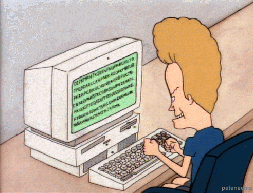

<h1 align="center"> Hello, welcome to my profile! </h1>

   

<h1>About me 🙋‍♂️</h1>

- I'm Full Stack Developer, actually using Typescript, Angular, .NET and Ionic;

- I’m technical degree in enterprise administration at ETEC MCM;

- Studying analysis and systems development at FIT;

- I love football and a cold beer.

<h1>My Stacks 🎲</h1>

   
   
   
   
   
   

 <h1 align="left">Let´s Talk</h1>
  You can find me on social media bellow 
  
 
    
    
  

